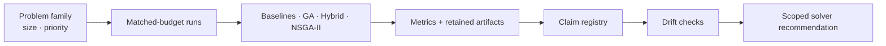

<!-- BRAND_REFRESH_2026_08_25 -->
<div align="center">

# 🧬 Evolutionary Solver Benchmark Lab

### Benchmark the solver, not the branding.

**A claim-governed optimization lab for comparing cheap baselines, pure evolutionary methods, hybrid paths, and NSGA-II under matched function-evaluation budgets.**


[Choose a solver](#quickstart) · [Current reading](#current-evidence-reading) · [Method](#how-the-lab-works) · [Full technical reference](README.technical.2026-08-25.md)

</div>

---

> **The best algorithm is the one that survives a fair budget and an explicit scope.**

This repository asks a practical question: which solver family should you actually choose for a problem family, size tier, and objective priority when reproducible evidence matters more than algorithm identity?

## What makes this different

| Principle | Contract |
|---|---|
| **Baselines are real competitors** | Hill climbing, greedy repair, nearest-neighbour, and local search are not straw men. |
| **Budgets are matched** | Comparisons are tied to function-evaluation budgets rather than uncontrolled runtime narratives. |
| **Claims are scoped** | A result for one family, size range, or objective is not silently generalized to another. |
| **Drift is checked** | Machine-readable claim registries and release artifacts keep prose aligned with retained evidence. |

## Current evidence reading

| Problem family | Practical reading |
|---|---|
| Monotone bitstrings | `hill_climb` is the practical default in the tested scope. |
| Tested deceptive bitstrings | A representative pure-GA path can be meaningful. |
| Knapsack | Guidance remains family-conditioned. |
| TSP | `nearest_neighbor_2opt` is the practical default; selected hybrids are narrow quality-first paths. |
| ZDT family | Pure NSGA-II remains the default path in the tested scope. |

## How the lab works



## Quickstart

```bash
python -m venv .venv
# Windows
.venv\Scripts\activate
# Linux / macOS
source .venv/bin/activate

python -m pip install --upgrade pip
pip install .
```

Ask for a recommendation or run a packaged preset:

```bash
ga-lab-recommend-solver --problem onemax --size 128 --priority default --format json
ga-lab-recommend-preset --problem zdt1 --size 50 --priority hv --format json
ga-lab-run --preset onemax_small --output-root ./ga-lab-outputs
```

Stable Python API:

```python
from ga_lab.api import recommend_solver, run_preset

recommendation = recommend_solver("onemax", 128, "default")
result = run_preset("onemax_small", output_root="ga-lab-outputs")
```

## Boundaries

- Recommendations apply only to tested problem families, ranges, budgets, metrics, and retained claim states.
- Internal quality-first paths are not automatically external defaults.
- This is a solver-choice laboratory, not a claim that genetic algorithms dominate every problem.
- Reproducing a conclusion requires the relevant fixtures, presets, registry state, and verification commands.

## Full technical reference

The original detailed README — including the auto-generated solver matrix, evidence snapshots, local study commands, release governance, and complete experiment catalogue — is preserved unchanged at:

**[README.technical.2026-08-25.md](README.technical.2026-08-25.md)**
